`Uniswap`是`DeFi`中最著名的协议之一，`Uniswap`本质是一个自动化做市商（`AMM`），它舍弃了传统订单薄的撮合方式，采用流动池加恒定乘积公式算法($x×y=k$)为不同加密资产提供即时报价和兑换服务。

`Uniswap`是`DeFi`中最著名的协议之一，`Uniswap`本质是一个自动化做市商（`AMM`），它舍弃了传统订单薄的撮合方式，采用流动池加恒定乘积公式算法($x×y=k$)为不同加密资产提供即时报价和兑换服务。

## 什么是Uniswap

关于什么是`Uniswap`，先看一下`Uniswap`白皮书中的定义：

> Uniswap is a protocol for automated token exchange on Ethereum. It is designed around ease-of-use, gas efficiency, censorship resistance, and zero rent extraction.

`Uniswap`是一个基于以太坊的自动代币交换协议，它的设计目标是：易用性、`gas`高利用率、抗审查性和零抽租。

-   ease-of-use（易用性）：`Token A`换`Token B`，在`Uniswap`也只要发出一笔交易就能完成兑换，在其它交易所中可能需要发两笔交易：第一笔将`Token A`换成某种媒介货币，如`ETH`, `DAI` 等，然后再发第二笔交易换成`Token B`。
    
-   `gas efficiency`（`gas`高利用率）：在`Uniswap`上消耗的`gas`量是以太坊上的几家主流去中化交易所中最低的，也就代表在Uniswap交易要付的矿工费最少。
    
    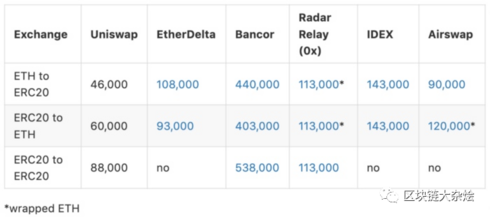
    
-   `censorship resistance`（抗审查性）：抗审查性体现在`Uniswap`上架新`Token`没有门槛，任何人都能在`Uniswap`上架任何`Token`。这在去中心交易所中很少见，虽然大多数的去中心化交易所不会像中心化交易所那样向你收取上币费，但还是需要提交上币申请，通过审查后运营团队才会让你的`Token`可以在他们的交易所上交易。下面是各去中心化交易所上币规则的详情：
    
-   KyberSwap上币规则：[https://developer.kyber.network/docs/Reserves-ListingProcess/](https://developer.kyber.network/docs/Reserves-ListingProcess/)
    
-   EtherDelta上币规则：[https://steemit.com/cryptocurrency/@mindseye69/new-etherdelta-coin-listing-rules](https://steemit.com/cryptocurrency/@mindseye69/new-etherdelta-coin-listing-rules)
    
-   IDEX上币规则：[https://medium.com/@forrestwhaling/idex-token-listing-guidelines-eae00785fdd2](https://medium.com/@forrestwhaling/idex-token-listing-guidelines-eae00785fdd2)
    
-   Uniswap上币规则：[https://uniswap.org/docs/v1/frontend-integration/token-listing/](https://uniswap.org/docs/v1/frontend-integration/token-listing/)
    
-   `zero rent extraction`（零抽租）:在`Uniswap`协议设计中，开发团队不会从交易中抽取费用，交易中的所有费用都归还给流动性提供者。
    

## 自动化做市商（AMM）

传统的交易所有一个订单薄(Order Book)，订单薄上记录着买卖方向，数量和出价，交易所负责对买卖双方进行配对，一旦订单薄中最高价格低于或等于最低价格，就会促成交易，同时会产生一个新的成交价，传统交易所有以下特点：

-   市场上必须要有用户进行挂单，要有一定量的订单（市场流动）。
-   订单必须重叠才能成交，即买价高于或等于卖价。
-   需要将资产存储在交易所。

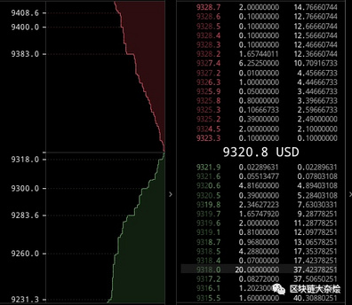

在订单薄模型市场中，买家期望用最低的价格买到想要的资产，而卖家则是期望用最高价格卖出同一项资产，如果交易要成立，买卖双方必须要在价格上达成共识，一是买家提高出价，二是卖家降低出价，如果双方都不要改变出价，这时候就要依靠做市商的参与，简单来说，做市商是一个促进交易的实体，它会在买卖两个方向上挂单，让想要交易的参与方只要跟做市商的订单撮合就能完成交易，而不需要等待对手方出现才能交易，极大的提高了市场的流动性。

为什么`Uniswap`不采用订单薄模型？

`Uniswap`部署在以太坊上，而以太坊每秒可以出来`15`笔左右的交易，这对于订单薄交易所来不可行，主要原因是：“订单薄模型依赖一个或多个外部做市商对某项资产一直不断的做市，而以太坊的`TPS`过低不支持做市商高频的交易，如果缺少了做市商，那么交易所的流动性立刻会降低，对于用户来说这样的交易所体验很差。”

`Uniswap`采用流动池加恒定乘法公式这种自动化做市商（AMM）模式实现了资产的交换，自动化做市商模式方式不需要买卖双方进行挂单，也不要买卖双方的订单重叠，可以进行自由买卖。

-   流动池：使用流动池来提供买卖双方交易，做市商只要把资金放入流动池即可
-   恒定乘法公式：按照流动池中`Token`的数量，自动计算买卖价格

### 流动池

流动池就是锁定在智能合约中所有的代币以及资金的总称，流动是资金转为代币，或代币转为资金的意思。

一个完整的流动池分为2个部份，分别表示不同的货币，成为一个交易对，在`Uniswap V1`中就是`ETH`及`ERC20`代币，在`Uniswap V2`中是支持不同`ERC20`代币直接交换，所以在`Uniswap V2`中的流动池可以允许两边是不相同的`ERC20`代币，其中`ETH`会自动转换成以`WETH`代币。为了简化，直接以`ETH-ERC20`交易对作为例子。

如下图所示，`Uniswap`将所有做市商的`ETH`集合在一起放在流动池左边， 将所有`ERC20`集合在一起放在流动池的右边。如果有用户要买`ERC20`代币，就从流动池的右边将`ERC20`代币转给用户，同时将用户支付的`ETH`添加的流动池的左边，然后重新计算流动池中的价格，等待下次交易。

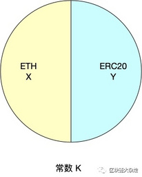

`Uniswap`是无法自己变出钱来，因此需要依赖外部资金向合约中提供流动性，向`Uniswap`流动池中提供流动性的用户被称为流动性提供者，当流动性提供者向`Uniswap`中注入流动性的时候，`Uniswap`会铸造出一个流动性代币(`LP`)，铸出`LP`代币数量是与用户注入的资金所占流动池中的资金比例相关,动性提供者可以选择在任何时间销毁自己持有的流动性代币。为了鼓励用于向`Uniswap`的流动池中提供更多的流动性，`Uniswap`会从每笔交易总额中抽取`0.3%`当成交易手续费，并将手续费全额交给那些将注资金到`Uniswap`资金池提供流动性的流动性提供者。

### 恒定乘积公式

假设在`Uniswap`中存在一个`ETH-DAI`交易对的流动池，用户在使用`DAI`与`ETH`兑换时需要一个方法来决定交易价格。

`Uniswap`定价模型非常简洁，它的核心思想是一个恒定乘积公式$x×y=k$  
。其中`x`和 `y`分别代表流动池中两种资产的数量，`k`是两种资产数量的乘积。

$x×y=k$的函数图像如下：  

假设乘积`k`是一个固定不变的常量，当用户使用`x`资产从流动池中兑换`y`资产时，流动池中`x`资产的数量会增加，`y`资产的数量会减少。由于`k`是恒定的，所以当`x`增长$\Delta X$时，需要将`y`减少$\Delta Y$才能保持等式的恒定。

$(x+\Delta X)× (y-\Delta Y)=k$

这里没有考虑到手续费的问题，如果要计算手续费的话，公式如下：

$(x+\Delta X \gamma ) × (y-\Delta Y)=k'$

$k' > k$

其中：$\rho =0.3\%$ ，$\gamma =1- \rho$

$\Delta X \gamma$ 表示扣除手续费后加入到流动池中的资产。由于在流动池中增加了手续费所以计算出来的`k'`会大于`k`，详细过程会在后面推导。

接下来会有一些数学公式的推导，为了方便理解，我们先对不含手续费的情况进行推导，包含手续费的推导过程放在最后。

#### 不含手续费

##### 交易价格计算

交易价格的计算分成两种：

-   InputPrice：向流动池中放入$\Delta X$个`Token`可以兑换出多少个$\Delta Y$ `Token`
-   OutputPrice：从流动池中取出$\Delta Y$ 个`Token`，需要向流动池中放入多少个$\Delta X$ `Token`

$x'=x+\Delta x=(1+ \alpha )x = \frac{1}{1-\beta } x$

$y'=y-\Delta y=\frac{1}{1+\alpha }y=(1-\beta )y$

$xy=x'y'=k$

其中：$\alpha=\frac{\Delta x}{x}$，$\beta =\frac{\Delta y}{y}$

$\Delta x=\alpha x$

$x'=(1+\alpha )x=\frac{1}{1-\beta }x \implies 1+\alpha =\frac{1}{1-\beta } \implies \alpha =\frac{\beta }{1-\beta }$

$\Delta x=\frac{\beta}{1-\beta }x$

$\Delta y=\frac{\alpha }{1-\alpha }y$

下面是`Input price`的函数图像：  
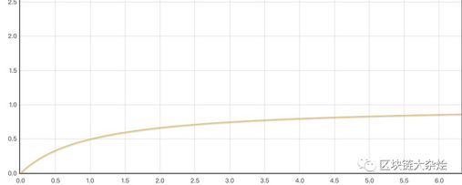

从上图可以看出向流动池中注入的$\Delta X$越多，可以从流动池中取出的$\Delta Y$也会越多，但是$\Delta Y$只会不断地逼近流动池中现有的代币数量，并不会超过，也就是说你永远无法一次性买断流动池中所有的。可以看出，恒等乘积公式可以提供无限的流动性，只要你想买就一定可以买到。

##### 交易滑点

交易滑点是指：“在买卖$Token$时，实际支付的价格和期望的交易价格之间的差别，称为交易滑点”。

从流动池中购买$\Delta Y$ `Token`需要支付$\Delta X$，所以本次购买的价格为：$\frac{\Delta X }{\Delta Y }$

$P=\frac{\Delta X }{\Delta Y }=\frac{\alpha x }{\frac{\alpha }{1+\alpha }y}=(1+\alpha)\frac{x}{y}$

$P'=\frac{x}{y}$

$滑点=P-P' = (1+\alpha )P' -P'=\alpha P'$

其中：$P'=\frac{x}{y}$表示当前流动池中的价格

从公式可以看出交易的滑点是与$\alpha =\frac{\Delta X}{x}$成线性关系。

下图是滑点的函数图像：  
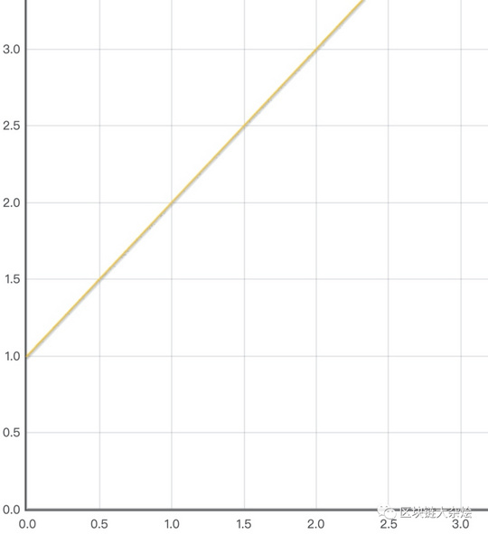

滑点(偏离幅度)取决于$\frac{\Delta X}{x}$, 当资金池中足够大时，滑点越小，资金池固定时，一个区块时间内净交易量越小，滑点越小，一个区块时间内的净交易量又与两个因素相关，一个是区块确认速度，一个是市场价格波动率，因此`Uniswap`恒定乘积做市的滑点与下面三个因素高度相关：

-   资金池的大小
-   区块确认速度
-   市场波动率

##### 流动池币价

当从流动池中购买$\Delta Y$代币后一定会引起当前流动池中的价格波动：

$P=\frac{x' }{y' }=\frac{(1+\alpha) x }{\frac{1 }{1+\alpha }y}=(1+\alpha)(1+\alpha)\frac{x}{y}$

其中：是购买代币后流动池中的币价

从公式可以看出流动池中的币价与成二次函数关系

下图是价格的函数图像：  
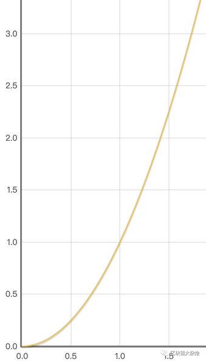

当流动池中的价格与外部市场价格不一致时就会有套利者出现，套利者监控全球各家交易所的价格，一旦发现两家交易所存在价差，就会同时在两边低买高卖赚取中间差价。由于套利者的存在，才使得`Uniswap`币价不会与全球市场脱节。

-   `Uniswap`中的价格高于外部市场时，套利者从外部市场低价买入 ，然后高价卖给`Uniswap`
-   `Uniswap`中的价格低于外部市场时，套利者从`Uniswap`低价买入，然后高价卖给外部市场

##### 表格

对于不理解上面公式的同学，可以参考以下表格中的数据自己在`excel`中手动演算一遍，可以更直观的理解`Uniswap`的工作原理。

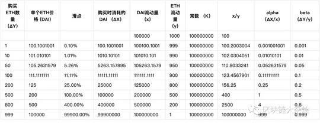

加入手续费的恒定乘积公式

以下过程是在计算手续费的情况下，将上面的公式重新推导了一遍。

##### 计算交易价格

$x'_\rho =x+\Delta x=(1+\alpha )x=\frac{1+\beta (\frac{1}{\gamma }-1)}{1-\beta }x$

$y'_\rho =y+\Delta y=\frac{1}{(1+\alpha \gamma )}y=(1-\beta )y$

$k'>x'_\rho y'_\rho =(1+\beta (\frac{1}{\gamma }-1))xy>k\ (加入手续费后计算出的k'>k)$

> `k`除了在有交易手续费的情况会变大，还有一个情况也会使`k`值产生变化，当向流动池中增加流动性的时候`k`会变大，当从流动池中取回流动资金时`k`会变小。具体变化比例可以参考`Uniswap`白皮书，这里就不做推导了。

其中：$\alpha = \frac{\Delta x}{x}$，$\beta = \frac{\Delta y}{y}$，$0\leq \rho < 1$ ，$\gamma =1-\rho$ ，目前交易费为：$\rho = 0.3\%$

$\Delta x=\frac{\beta}{1-\bata} \cdot \frac{1}{\gamma}\cdot x$

$\Delta y=\frac{\alpha \gamma }{1+\alpha \gamma } \cdot y$

##### 交易滑点

$P=\frac{\Delta X }{\Delta Y }=\frac{\alpha x }{\frac{\alpha \gamma }{1+\alpha \gamma }\cdot y}=\frac{(1+\alpha \gamma )}{\gamma }\frac{x}{y}$

$P'=\frac{x}{y}$

$滑点=P-P' = \frac{(1+\alpha \gamma )}{\gamma }\frac{x}{y} -\frac{x}{y}=\frac{1+(\alpha-1)\gamma }{\gamma }\frac{x}{y}$

##### 流动池的币价

$\frac{x'_\rho }{y'_\rho }=\frac{(1+\alpha )x}{\frac{1}{1+\alpha \gamma }y}=(1+\alpha )(1+\alpha \gamma )\frac{x}{y}$

## 流动池收益与风险

在`Uniswap`中流动性提供者的收益主要来自于交易抽成，`Uniswap`会从每笔交易中抽取`0.3%`的手续费，并将手续费按流动性提供者所占流动池的比例分配给流动性提供者。

### impermanent loss

向`Uniswap`中提供流动性的人会发现一个现象：“目前在流动池中资金的价值比放入流动池之前的资金价值少了，也就是资金缩水了”，这种现象被称为“impermanent loss”，`impermanent loss`中文翻译成“无常损失”，简单来说`impermanent loss`是指你将加密货币放入`uniswap`中赚取的收益与你将加密货币放入钱包中的收益之间的差，公式为：$L=profit_{lp}-profit_{bodl}$

> hodl指不看币价涨跌长期持有某种加密货币（hold on for dear life）

`impermanent loss`通常是由于流动池中的价格发生波动引起的，下面看一个例子：

$e × t=k$  
$p=t/e$  
$e=\sqrt \frac{k}{p}$  
$t=\sqrt {k ×p}$

其中：表示流动池中`ETH`数量，表示流动池中`DAI`数量，表示流动池中的价格

开始用户向流动池中注入$e=100$，$t=10,000$，当前市场的价格：$p=\frac{t}{e}=100$

$k=et=100*10,000=1,000,000$

假设现在外部市场价格发生了变化，价格变成：$p'=120$，由于发生价格差，这时套利者开始工作，套利者通过搬砖将流动池中的价格维持与外部是市场一致。这时流动池中最新的数量为：

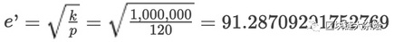  
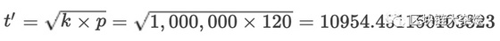

计算`HODL`时的资金 :

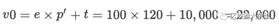

计算放入流动池后的资金:

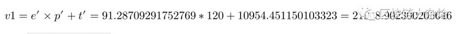

计算`impermanent loss`:

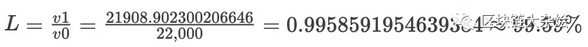

可以看出价格从`100`变成`120`后我们的资金只有之前的`99.59%`，损失了`4%`左右。只要这时候我们不将资金从流动池中取出，一旦流动池中的币价回到`100`时，我们是没有损失的，这是为什么叫`impermanent loss`无常损失的原因。

下图演示`impermanant loss`的比率与当前价格变化的关系，`O`列表示资金刚放入流动池的情况，`O->H`表示价格上涨时`impermanent loss`的变化，`A<-O`表示价格下跌时`impermanent loss`的变化。

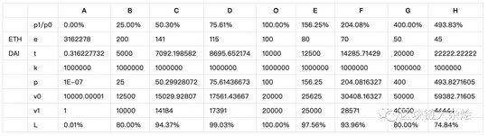

下图是根据上面数据画出的函数图像，蓝色的曲线是不包含手续费的，黄色的图像包含手续费，红色的线条是我手动添加上去的为了方便说明。

先看蓝色曲线，当不计算手续费收益的情况下，无论币价上涨或下跌，流动性提供者`100%`会有损失。

再看黄色的曲线，由于黄色曲线是计算手续费收益的，所以只要币价在一个范围内波动，流动性提供者可以稳赚手续费收益。  
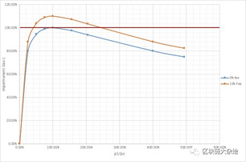

由此可以得出一个结论要介绍`impermanent loss`对流动性提供者的影响，可以为两个币价之间波动小的流动池提供流动性。

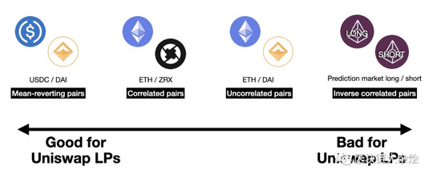

-   `mean-reverting pairs`：均值回归的交易对，比如稳定币交易对两者波动是最小的，可以最大程度减少`impermanent loss`
-   `correlated pairs`：有正相关性的交易对，例如`ETH/ZRX`，这两个币的波动方向基本上是一致的，同涨同跌，两者之间的相对波动小
-   `Uncorrelated pairs`：非相关性的交易对，如`ETH/DAI`，为这种交易对提供流动性，赚取的交易费有可能会覆盖`impermanent loss`
-   `Inverse correlated pairs`：负相关的交易对，是最危险的，他们之间波动方向相反，两者之间的相对波动范围最大。

下面是计算`impermanent loss`的公式

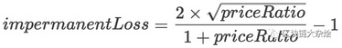

其中：`priceRatio`是价格变化比例

以下是不计算手续费情况下推导过程：

$et=e't'=k$  
$\frac{e}{t}=P$,$\frac{e'}{t'}=P'$,$\frac{e'}{t'}=\sqrt \frac{P'}{P}$,$\frac{t'}{t}=\sqrt \frac{P}{P'}$,$priceRatio=\sqrt \frac{P}{P'}$

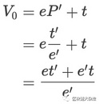  
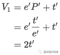  
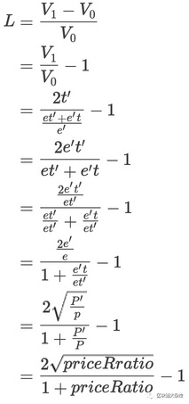

## 总结

### 优点

-   完全去中心化，不依赖第三方，任何人都可以基于`uniswap`构建自己的应用
-   可以自由地创建任何`ERC20`交易对
-   与其他去中心化交易所相比`gas`费用更低
-   任何人都可以向`uniswap`流动池中提供流动性，人人都可以是做市商

### 缺点

-   需要依赖套利者去平衡`uniswap`与外部交易所之间的汇率
-   对大户不友好，进行大额的交易会造成很大的滑点
